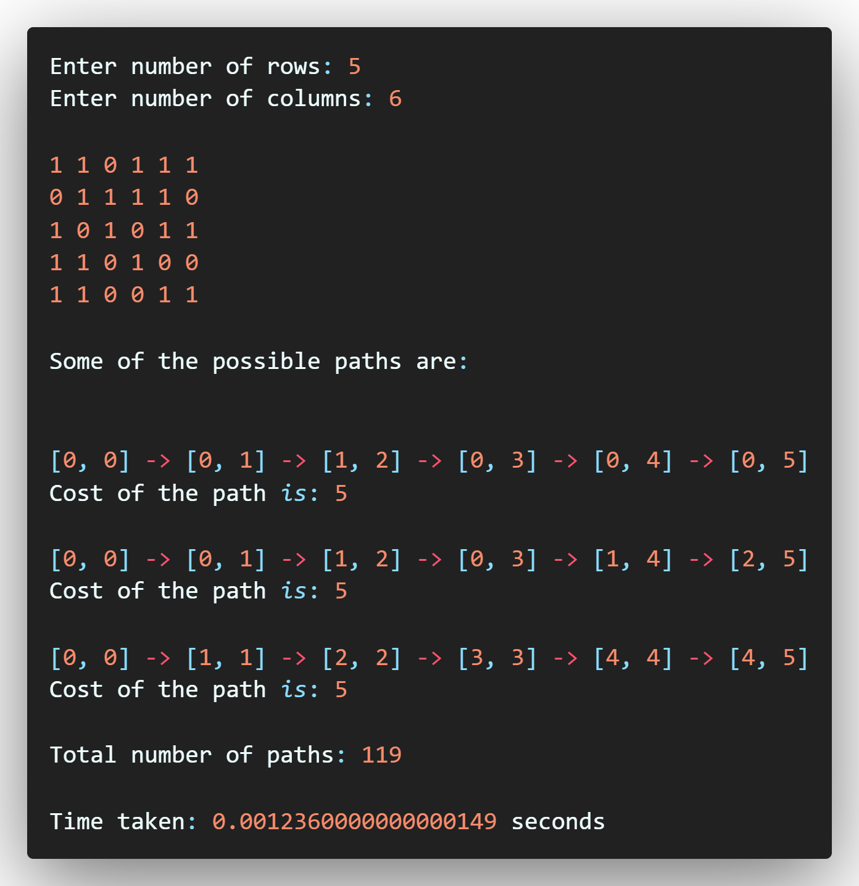

<h1 align="center">DAA - PROJECT<h1>


<div align="center">


</div>


## Python Modules used
> random

> timeit


## About
- In this project, the concept of backtracking is used.
- The project is done in python.


## Problem Statement
- User has to provide the size of the matrix that is the `number of rows` and `number of columns.`
- The matrix will be generated automatically using the `random` library of python.
- The matrix will only contain values `1` and `0` in it. 
- There is a condition that we can move to the neighboring cell only if that cell has value `1` in it.
- If there is `0` in the neighboring cell, it means that we cannot pass through that cell and, we have to take another route.
- Here, another route means any neighboring cell which has value `1`.
- Following this algorithm, we have to calculate the number of all possible paths from the first cell to the last column.
- To find the efficiency of the program, we have used another library called `timeit.`
- We have to find all possible paths from the first cell `array[0][0]` to the last column of the matrix `array[x][n].`
- Also, we have to print some of the sample paths.


## Members
- Rishabh Rathi - [LinkedIn](https://in.linkedin.com/in/rishabhrathi22) - [Github](https://github.com/rishabhrathi22) - [Website](http://rishabhrathi.co/)
- Shreyas Barve - [LinkedIn](https://in.linkedin.com/in/shreyas-barve-153a5b192) - [Github](https://github.com/shreyasbarve) - [Website](https://shreyasbarve.github.io/)


## Output



## Video Explaination of Code

[](https://youtu.be/-EBysYVSUrU "Video Explaination")


## Some information
- Install Python
  - [www.python.org](https://www.python.org/)
- Check python version
  ```python
  python --version
  ```
